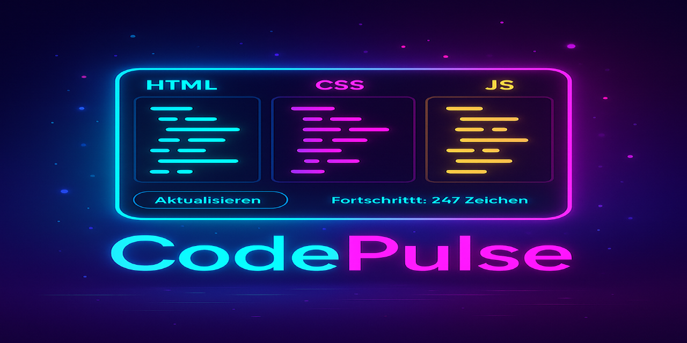

|  |
|---|

|  |  |  |  |  |  |
|---|---|---|---|---|---|

|  |  |  |  |
|---|---|---|---|

<br>

> ⚡ CodePulse – Realtime HTML/CSS/JS Editor mit Neon UI
   - **CodePulse** ist ein stilvoller, Code-Editor für HTML, CSS und JavaScript mit Live-Vorschau, Fortschrittsanzeige und Farblich differenzierten Editoren.  
     - Er wurde speziell für Entwickler/innen, Designer/innen und Lernende konzipiert – schnell, übersichtlich und vollständig lokal ausführbar.

<br>



<br>

---

<br>

|✨ Features|
|---|

- 🎨 **Farbkodierte Editoren** für HTML (Cyan), CSS (Magenta) und JS (Gelb)
- 🖥️ **Live-Vorschau mit sichtbarem Basis-Layout** (per `Blob`-Rendering)
- ⏱️ **Echtzeit-Fortschrittsanzeige** (Zeichenzähler)
- 🌌 **Neon UI mit sanft animiertem Hintergrund**
- 🔐 **100 % lokal, keine Internetverbindung notwendig**
- 🧰 **Keine Frameworks, keine Abhängigkeiten – pures HTML/CSS/JS**

<br>

---

<br>

|🧠 Ideal für|
|---|

- Entwickler:innen, die schnelle HTML/CSS/JS-Tests benötigen
- Designer:innen mit Fokus auf visuelles Prototyping
- Bildungszwecke, Coding-Workshops und Selbststudium
- Code-Demos ohne Cloud, ohne Server, ohne Tracking

<br>

---

<br>

|📁 Projektstruktur|
|---|

```yarn
CodePulse
├── index.html            # Haupt-UI und App-Container
│
├── css/
│   └── style.css         # Neon-Layout, Animationen, Farbschema
│
├── js/
│   └── editor.js         # Vorschau-Rendering per Blob, Fortschrittsanzeige
│
└── assets/
    └── CodePulse.png     # Bildliche Projektvorschau für Doku

```

<br>

---

<br>

|🚀 Nutzung|
|---|

1. 🔽 Lade das Projekt herunter und entpacke es  
2. 📂 Öffne `index.html` in einem modernen Browser  
3. ✏️ Beginne sofort mit dem Schreiben deines Codes  
4. 🔁 Klick auf **„Vorschau aktualisieren“** um Änderungen live zu sehen  
5. 📊 Behalte deinen Fortschritt im Blick

<br>

---

<br>

|🔮 Erweiterungsideen|
|---|

- 📦 Export-Funktion (HTML/CSS/JS als ZIP)
- 💾 Auto-Speicherung (localStorage oder IndexedDB)
- 🌙 Dark-/Light-Mode Toggle
- 🧠 Syntax-Highlighting (z. B. via CodeMirror)
- 📱 Mobile PWA mit Offline-Unterstützung

<br>

---

<br>

> Erstellt mit Leidenschaft für Code und Design  
  - Entwickelt von **Thorsten Bylicki** – powered by Kreativität, Klarheit und Kontrolle
